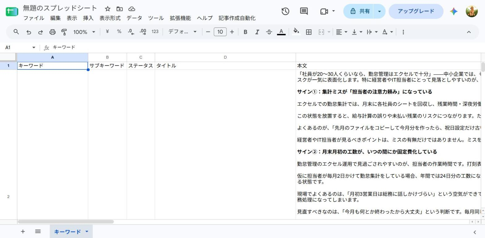
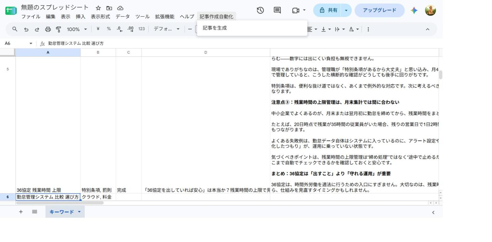
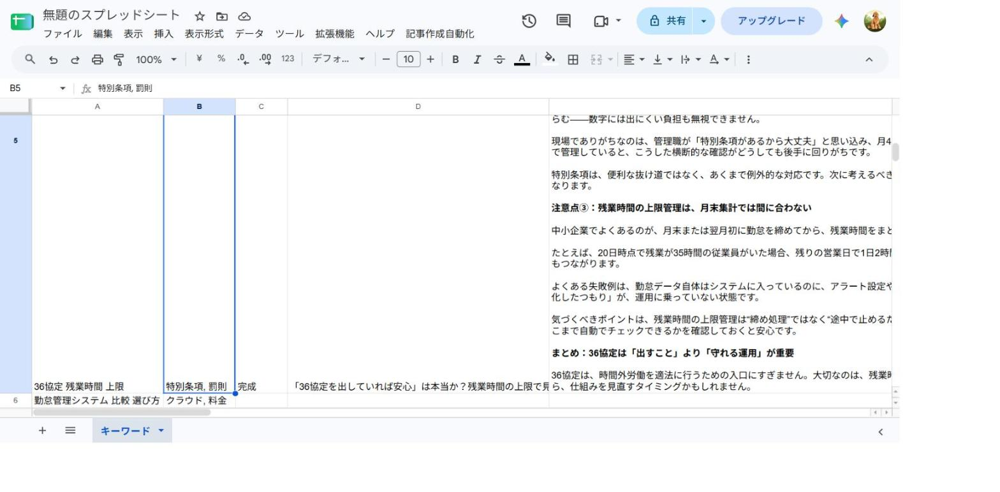

# セットアップ・実行手順

このフォルダのコードは Google Apps Script（GAS）です。ブラウザ上のGoogleアカウントに
紐づけて動かす必要があるため、ここに置いたファイルは**あなたのGoogleアカウントにコピーして**実行してください。

## 1. スプレッドシートを用意する

新しいGoogleスプレッドシートを作り、シート名を「キーワード」にして、1行目に次のヘッダーを入れます。

```
キーワード | サブキーワード | ステータス | タイトル | 本文 | メタディスクリプション | WordPress URL
```

2行目以降に、`../case2-keywords.csv` の内容（キーワード5本）を貼り付けます。
「ステータス」列はすべて「未生成」にしておきます（CSVのままでOK）。
「タイトル」「本文」「メタディスクリプション」「WordPress URL」は空欄のままにします。

## 2. Apps Scriptプロジェクトを作る

1. スプレッドシートの メニュー「拡張機能」→「Apps Script」を開く
2. 最初からある `コード.gs`（`Code.gs`）の中身を消して、このフォルダの各ファイルの内容を
   同じファイル名で貼り付ける（`Config.gs` `Menu.gs` `PromptBuilder.gs` `ChatGptClient.gs`
   `WordPressClient.gs` `Main.gs`）。ファイルはApps Scriptエディタの「+」→「スクリプト」で追加する
3. 左メニューの「プロジェクトの設定」を開き、`appsscript.json` の内容もこのフォルダのものに合わせる
   （「`appsscript.json` マニフェスト ファイルをエディタで表示する」にチェックすると編集できる）

## 3. APIキーを設定する

**重要：APIキーやパスワードは、コードの中に直接書き込んではいけません。**
コードは誰かに共有したり、GitHubなどに置いたりする可能性があり、その瞬間に漏洩してしまうためです。
このプロジェクトでは、コードから直接は見えない「スクリプト プロパティ」という保管場所にキーを置き、
コード側は`PropertiesService.getScriptProperties()`という仕組みで必要なときだけ読み出す形にしています
（`Config.gs`の`getRequiredProperty`関数）。そのため、キーの値は本マニュアルにも載せません。

### 3-1. OpenAI（ChatGPT）のAPIキーを用意する

1. https://platform.openai.com/api-keys を開く（OpenAIのアカウントでログイン）
2. 「Create new secret key」のようなボタンで新しいキーを作成する
3. 表示されたキー（`sk-...`で始まる文字列）をコピーする。**この画面を閉じると二度と表示されないので、
   その場でメモ帳等に一時的に貼っておく**（作業が終わったらそのメモは削除する）

### 3-2. Apps Scriptにキーを設定する

1. Apps Scriptエディタの左メニューにある歯車アイコン「プロジェクトの設定」をクリックする
2. 下にスクロールし、「スクリプト プロパティ」という見出しを探す
3. 「スクリプト プロパティを追加」ボタンをクリックする
4. 「プロパティ」の欄に `OPENAI_API_KEY` と入力する（この名前は決まった表記なので、そのまま正確に入力する）
5. 「値」の欄に、3-1でコピーしたOpenAIのAPIキーを貼り付ける
6. 「スクリプト プロパティを保存」をクリックする
7. 一覧に `OPENAI_API_KEY` という行が追加されていれば設定完了（値そのものは他の人に見せる必要はない）

`Config.gs`の`DRY_RUN`が`true`のままであれば、これで設定は完了です（下の3-3は不要）。

### 3-3.（任意・実際にWordPressへ投稿する場合のみ）WordPressのApplication Passwordを設定する

今回の案件は`DRY_RUN=true`（実際には投稿しない）運用のため、通常はこの手順は不要です。
将来、実際のWordPressサイトに接続する場合は、次の3つも同じ「スクリプト プロパティ」に追加します。

1. WordPressの管理画面にログインし、「ユーザー」→自分のプロフィール画面を開く
2. 下部の「アプリケーションパスワード」欄で、名前（例：`gas-seo-automation`）を入れて新しいパスワードを発行する
3. 表示された文字列（スペース区切りの英数字）をコピーする。**この画面を閉じると再表示できないので注意**
4. Apps Scriptの「スクリプト プロパティ」に、以下の3つを追加する

   | プロパティ               | 値                                                       |
   | ------------------------ | -------------------------------------------------------- |
   | `WORDPRESS_BASE_URL`     | 例: `https://example-saas.co.jp`（WordPressサイトのURL） |
   | `WORDPRESS_USERNAME`     | WordPressのユーザー名                                    |
   | `WORDPRESS_APP_PASSWORD` | 3でコピーしたアプリケーションパスワード                  |

5. `Config.gs`の`DRY_RUN`を`false`に変更する（これを忘れると設定しても実際には投稿されません）

**どちらのキーも、メールやチャットで平文のまま送らないでください。** 受け渡しが必要な場合は、
1Passwordなど共有できるパスワード管理ツールを使うか、電話等の口頭で伝える方法を推奨します。

## 4. 実行する

**この方式は「選択した行」を対象に記事を作ります。** メニューを押す前に、対象のキーワード行を
クリックして選んでおいてください（複数行をまとめて選ぶと、その全部を処理します）。

1. スプレッドシートの画面を再読み込みする（メニューが反映されるまで少し待つ場合があります）
2. 記事を作りたいキーワードの行（例：2行目）をクリックして選択する
3. 上部に追加された「記事作成自動化」メニュー → 「記事を生成」をクリック
4. 初回は権限の承認画面が出るので、内容を確認して許可する
5. 完了メッセージが出たら、選んだ行の「タイトル」「本文」「メタディスクリプション」列が
   埋まり、「ステータス」列が「未生成」→「完成」になっていることを確認する
6. 「表示」→「ログ」（または実行結果の下の「ログを表示」）を開き、
   `【DRY_RUN】WordPressへの送信ペイロード` のログで、
   `title` / `content` / `status: "draft"` / `excerpt` が正しく入っていることを確認する
   （このログが、WordPressに送るはずだった内容そのものです。今回は実際には送信していません）
7. 5本まとめて作りたいときは、2〜6行目（見出しを除く全データ行）をドラッグして選択してから
   メニューを実行すると、選んだ行すべてを1回で処理します

## 5. 公開前の確認事項（必ず行うこと）

**生成された記事は、そのまま公開してはいけません。** ChatGPTは、法律や数字に関する内容を
「もっともらしく」間違えることがあります（講師フィードバック・2026-09-30）。特に今回のような
勤怠・労務系のテーマ（有給休暇の年5日取得義務、36協定の残業上限、割増賃金率など）は、
具体的な数字や制度名が本文に出てくるため注意が必要です。

- 記事中に出てくる**法律名・制度名・具体的な数字**（「年5日」「36協定」等）は、公開前に
  **一次情報**（厚生労働省のサイトなど、制度を管轄する公式の情報源）で必ず事実確認する
- 事実確認は、記事を書いたご担当者本人ではなく、**別の人が確認する**のが望ましい
- 事実と異なる記述が見つかった場合は、その部分を手動で修正してから公開する
- この「AIが下書きを作る → 人が事実確認する → 必要なら手直しする」の工程は省略しない
  （提案書に明記した「事実確認・最終調整は人が行う前提の下書き」を実際の手順に落とし込んだもの）

## 6. 日常の使い方（運用マニュアル）

ここから下は、セットアップが終わったあと、**毎週・毎月の運用で使う部分**です。
1〜5は最初の1回だけで、普段はこのセクションだけ見れば使えます。

シートの列構成は次の通りです（左から「キーワード」「サブキーワード」「ステータス」「タイトル」「本文」）。



### 新しいキーワードで記事を作りたいとき

1. スプレッドシートの一番下に新しい行を追加する
2. 「キーワード」列に対策キーワードを入力する（例：`有給休暇 管理 方法`）
3. 「サブキーワード」列に、関連して触れたい話題があれば入力する（無ければ空欄でよい）
4. 「ステータス」列に **`未生成`** と入力する
5. 「タイトル」「本文」「メタディスクリプション」「WordPress URL」は空欄のままにする（自動で埋まる）

### 「記事を生成」ボタンの使い方

1. 記事を作りたい行をクリックして選ぶ（複数行をまとめて選ぶと、その分だけ一度に処理する）
2. 上部メニュー「記事作成自動化」→「記事を生成」をクリックする（下の画像の通り、選んだ行の上にこのメニューが表示されます）

   

3. 少し待つと完了メッセージが出て、選んだ行の「タイトル」「本文」「メタディスクリプション」が埋まる

### 「ステータス」列の見方

| 表示       | 意味                                                                                              |
| ---------- | ------------------------------------------------------------------------------------------------- |
| `未生成`   | まだ記事を作っていない。この状態の行を選んで「記事を生成」を実行できる                            |
| `完成`     | AIが下書きを作り終えた状態。**この時点ではまだ公開していない**（5章の事実確認がまだの場合がある） |
| `エラー`   | 生成中に何かうまくいかなかった。実行ログ（「表示」→「ログ」）で原因を確認する                     |
| `投稿済み` | 人が内容を確認し、実際にWordPressへ公開した状態（下記の通り、人が手動で書き換える）               |

実際に生成が終わると、「ステータス」列が次のように `完成` になります。



### 「投稿済み」への変え方

このシステムは、記事を自動では公開しません（やらないことの1つです）。公開は必ず人が行います。

1. 「完成」になっている行の本文を、5章の手順で事実確認・必要な手直しをする
2. WordPressに手動でログインし、内容をコピーして記事として公開する
3. 公開できたら、スプレッドシートの該当行の「ステータス」列を、`完成` から **`投稿済み`** に手で書き換える
   （公開したWordPressの記事URLがあれば、「WordPress URL」列にも貼っておくと後で分かりやすい）

## トラブルシューティング

よくある症状と対処法です。実行後に出るメッセージ・実行ログの文言を目印にしてください。

| 症状・表示されるメッセージ                                                 | 原因                                                                                                                                   | 対処法                                                                                                                                                                                        |
| -------------------------------------------------------------------------- | -------------------------------------------------------------------------------------------------------------------------------------- | --------------------------------------------------------------------------------------------------------------------------------------------------------------------------------------------- |
| 上部に「記事作成自動化」メニューが出てこない                               | スプレッドシートがメニューの反映前に開かれている                                                                                       | 画面を再読み込みする。直らない場合はApps Scriptエディタで`onOpen`関数を選び、手動で一度実行する                                                                                               |
| 「スクリプトプロパティ『OPENAI_API_KEY』が設定されていません」             | 3章のAPIキー設定が未完了                                                                                                               | 3章の手順通りに「プロジェクトの設定」→「スクリプト プロパティ」で設定する                                                                                                                     |
| 「記事を作りたいキーワードの行を選択してから、もう一度実行してください」   | ヘッダー行（1行目）だけを選んでいる、または何も選んでいない                                                                            | データ行（2行目以降）をクリックして選んでから、もう一度「記事を生成」を実行する                                                                                                               |
| ステータスが「エラー」になる                                               | ChatGPT APIの呼び出しで何か失敗した（キーが無効、利用上限など）                                                                        | 「表示」→「ログ」でAPIからの生のレスポンスを確認し、APIキーの有効性やOpenAI側の利用上限（課金設定）を確認する                                                                                 |
| 記事は生成されたが内容が不自然／文字数が短い                               | AIの出力が狙った品質に届かなかった                                                                                                     | その行だけ「ステータス」を`未生成`に戻し、もう一度「記事を生成」を実行する（AIの出力は毎回多少変わります）                                                                                    |
| 公開後に記事の内容に誤りが見つかった                                       | 5章の事実確認が不十分だった、またはAIが数字等を誤生成した                                                                              | WordPress側の記事を手動で修正する。次回以降は公開前の事実確認（5章）を必ず行う                                                                                                                |
| 実行中に止まってしまう／「実行時間の上限を超えました」というエラー         | Google Apps Scriptは1回の実行が6分以内に終わる必要がある。まとめて多くの行を選んで実行すると、件数によってはこの上限を超えることがある | 選ぶ行数を減らし、1行（または数行）ずつに分けて「記事を生成」を実行する。どうしても件数が多い場合は、ChatGPT API呼び出し側のタイムアウト設定を見直す                                          |
| 「429」や「レート制限（quota）」に関するエラー                             | OpenAI（ChatGPT）側、または実際にWordPressへ送信する場合はWordPress側で、短時間に呼び出しすぎて制限にかかった                          | 少し時間をおいてから再実行する。頻発する場合は、OpenAIダッシュボードの利用上限（課金設定）や、WordPress側のアクセス制限を確認する                                                             |
| （実際にWordPressへ送信する設定にした場合）WordPressに下書きが反映されない | Application Passwordの権限が不足している、またはWordPress側でREST APIが無効化されている                                                | WordPressの管理画面で、使っているユーザーの権限（投稿を作成できるか）とApplication Passwordが有効かを確認する。合わせて、WordPress側でREST API（`/wp-json/`）が無効化されていないかも確認する |
